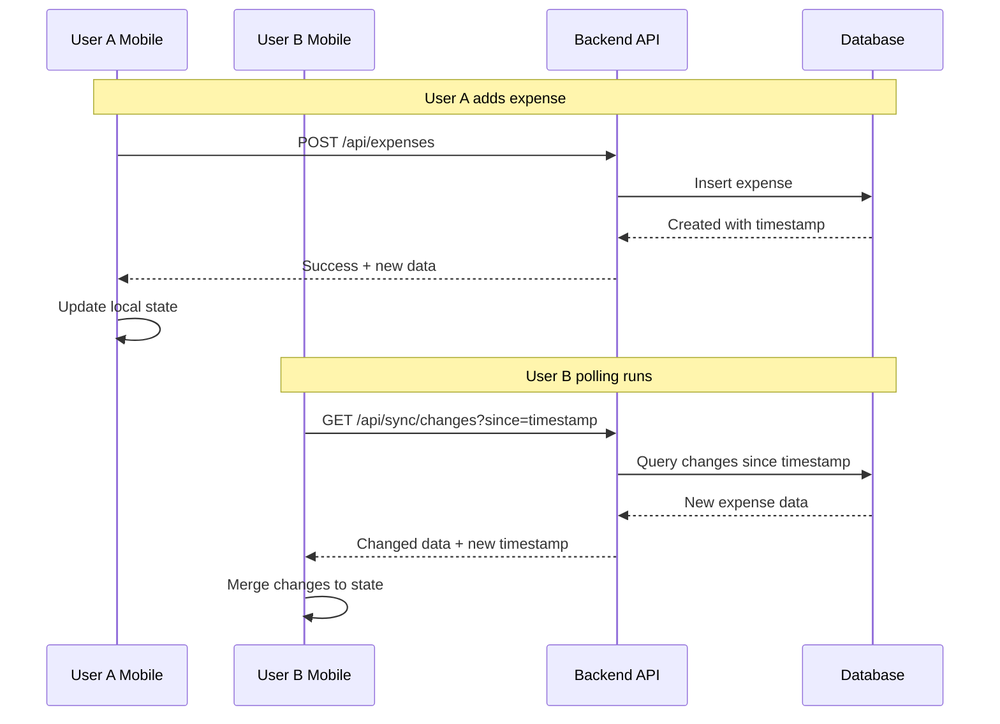

# Data Synchronization Strategy for Hisab Mobile App

## Current State Analysis

### Current Architecture
- **Mobile App**: React Native (Expo) with Context-based state management
- **Backend**: FastAPI with MySQL database
- **Current Sync Method**: Manual pull-to-refresh only
- **Data Flow**: User manually triggers [`refreshData()`](mobile/src/contexts/DataContext.js:76) which fetches all data

### Identified Issues
1. No automatic data refresh - users must manually pull to refresh
2. No detection of changes made by other users
3. Full data fetch on every refresh (inefficient)
4. No background sync capability
5. No app state-aware refresh (foreground/background)

## Proposed Solution: Enhanced Smart Polling

### Strategy Overview
Implement an intelligent polling system that:
- Automatically refreshes data at configurable intervals
- Uses ETags or timestamps for efficient change detection
- Adapts polling frequency based on app activity
- Provides visual feedback for sync status

### Architecture Diagram

```mermaid
flowchart TD
    subgraph Mobile App
        A[SyncManager] --> B[DataContext]
        A --> C[App State Monitor]
        A --> D[Network Monitor]
        B --> E[Local Cache]
        
        C -->|foreground| F[Fast Polling - 15s]
        C -->|background| G[Slow Polling - 60s]
        C -->|inactive| H[No Polling]
        
        D -->|online| F
        D -->|offline| I[Queue Changes]
    end
    
    subgraph Backend
        J[/api/sync/changes] --> K[Change Detection]
        K --> L[Database]
        J -->|returns| M[Modified Data Only]
    end
    
    A -->|poll| J
    M -->|update| B
```

### Data Flow for Multi-User Sync



## Implementation Components

### 1. Backend Changes (Minimal)

#### New Endpoint: `/api/sync/changes`
```python
# Returns data modified since a given timestamp
GET /api/sync/changes?since={timestamp}

Response:
{
    "server_time": "2024-12-24T12:00:00Z",
    "changes": {
        "groups": [...],      # Groups modified since timestamp
        "expenses": [...],    # Expenses modified since timestamp
        "friends": [...],     # Friends modified since timestamp
        "activity": [...]     # New activity items
    },
    "has_changes": true
}
```

#### Database Schema Updates
Add `updated_at` timestamp columns to track modifications:
- `groups.updated_at`
- `expenses.updated_at`
- `user_friends.updated_at`

### 2. Mobile App Changes

#### New: SyncManager Context
A dedicated context for managing synchronization:
- Configurable polling intervals
- App state awareness (foreground/background)
- Network connectivity monitoring
- Last sync timestamp tracking
- Sync status indicators

#### Enhanced DataContext
- Integration with SyncManager
- Incremental data merging
- Optimistic updates for user actions
- Conflict resolution for concurrent changes

#### UI Enhancements
- Sync status indicator in header
- Last synced time display
- Manual sync button
- Visual feedback during sync

## Polling Strategy Details

### Adaptive Polling Intervals
| App State | Network | Polling Interval |
|-----------|---------|------------------|
| Foreground (Active) | Online | 15 seconds |
| Foreground (Idle) | Online | 30 seconds |
| Background | Online | 60 seconds (or disabled) |
| Any | Offline | No polling (queue changes) |

### Efficiency Optimizations
1. **Conditional Requests**: Only fetch if changes exist
2. **Incremental Sync**: Fetch only modified data
3. **Debounced Refresh**: Prevent multiple rapid refreshes
4. **Priority Loading**: Load critical data first (balances)

## Alternative Approaches Considered

### 1. WebSockets (Not Chosen)
- **Pros**: True real-time, efficient for high-frequency updates
- **Cons**: Requires additional infrastructure, connection management complexity, mobile battery drain
- **Decision**: Overkill for expense tracking use case

### 2. Push Notifications (Future Enhancement)
- **Pros**: Works in background, efficient battery usage
- **Cons**: Requires push notification service setup, platform-specific implementation
- **Decision**: Can be added later for important alerts

### 3. Server-Sent Events (Not Chosen)
- **Pros**: Simpler than WebSockets, server-driven
- **Cons**: React Native support limited, connection management issues
- **Decision**: Polling is more reliable for mobile

## Implementation Priority

### Phase 1: Foundation
1. Add `updated_at` columns to database
2. Create `/api/sync/changes` endpoint
3. Implement basic SyncManager in mobile app

### Phase 2: Smart Polling
4. Add app state detection
5. Implement adaptive polling intervals
6. Add network connectivity monitoring

### Phase 3: UX Enhancement
7. Add sync status indicators
8. Implement manual refresh button
9. Add last synced timestamp display

### Phase 4: Optimization (Optional)
10. Implement local caching with AsyncStorage
11. Add offline queue for user actions
12. Optimize data merging performance
